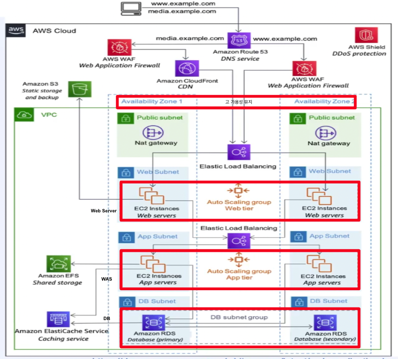
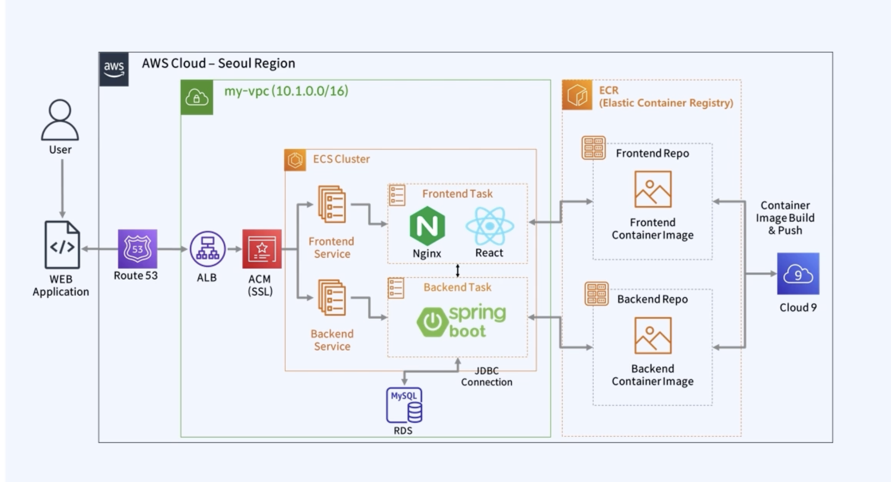

# ECS use Terraform

## Deploy

- Amazon ECS + Fargate (Serverless) + AWS Copilot CLI

## 3 Tier Architecture



- 1개의 Availability로 고가용이 불가능한 이유?

  ```
      1개의 AZ 자체에 여러 Lack이 존재하고, 아무리 Fail Over가 빠르다고 해도, 자연재해나 정전같은 물리적인 서버오류 시,
      1개의 AZ로는 대체가 불가능 함
      최소 2개는 이용 해야 함
  ```

- Scaling 처리나 Load Balancing은 어떻게 처리하나?

  ```
      EC2와 같은 인스턴스 환경을 일 경우 Auto Scaling 그룹을 사용하여 Scaling을 처리한다.
      이때, Auto Scaling 그룹은 기본적으로 CPU 점유율을 기반으로 하여 Scaling을 시도하는데, 이때 수분 정도 시간이 소요된다.
      그렇기 때문에, 특정 트래픽이 몰리는 시점에 미리 Scaling을 Scheduling을 시도해야 한다.

      또한 Load Balancing은 ELB를 주로 사용하여 부하분산을 진행하고,
      ELB는 보통 ALB와 NLB로 나눠지는데,
      ALB는 HTTP, HTTPS와 같은 L7 Switch 개념으로 Application Load Balancing 이다.
      NLB는 TCP, UDP와 같은 L4 Swtich 개념으로 Network Load Balancing 이다.
  ```

- 무조건적으로 Scaling처리를 해야하나?

  ```
    요구사항에 따라 바뀔수는 있지만,
    Serverless 형태로도 관리가 가능하다, Fargate를 사용하여 ECS, EKS를 구성할 수 있다.
  ```

- Database는 Primary, Secoundary는 어떤 구조인가?

  ```
      보통 DB의 여러구조가 존재하는데, 이때 Active-Standby 형태를 유지한다.
      Active단에서 실제 데이터 Read, Write가 진행되고 Active DB 문제가 발생시 Fail over를 Standby DB로 진행한다.
  ```

## ECS Architecture


