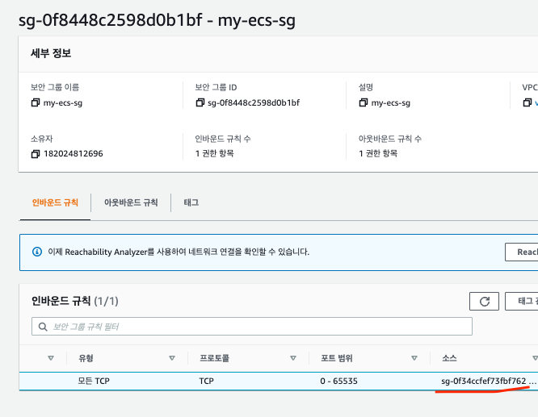

- 1. Get Docker Image

```bash

    docker pull zkfmapf123/helloworld

    docker run -d --name helloworld_container -p 3000:3000 zkfmapf123/helloworld

    curl http://localhost:3000/v1/healthCheck
```

- 2. Upload ECR Registry

```
    aws ecr get-login-password --region ap-northeast-2 | docker login --username AWS --password-stdin 182024812696.dkr.ecr.ap-northeast-2.amazonaws.com/ecs-donggyu

    >> Login Succeeded

    docker tag zkfmapf123/helloworld 182024812696.dkr.ecr.ap-northeast-2.amazonaws.com/ecs-donggyu:1.0

    docker push 182024812696.dkr.ecr.ap-northeast-2.amazonaws.com/ecs-donggyu:1.0

```

- 3. ECS 배포
- 보안그룹
  - my-ecs-alb-sg
  - my-ecs-alb
-

1. 보안그룹 생성 (my-ecs-alb-sg)

- ALB를 생성 (80, 443)
- ECS SG를 => 모든트래픽 -> ALB로 Mapping
- ECS 모든 트래픽을 허용하는 이유 -> ECS에서 동적포트를 사용할거기 때문에... -> Port번호를 줄인다면 (32768 ~ 61000)설정가능
- <br>RDS도 생성했다면, Inbound 규칙에 my-ecs-sg에 3306번을 Mapping</br>




2. Appllication Load Balancer

3. Load Balancer

- 4. (응용) ECR -> EventBridge + AWS CodeDeploy -> ECS 배포

- 5. Jenkins -> ECR -> AWS CodeDeploy -> ECS
