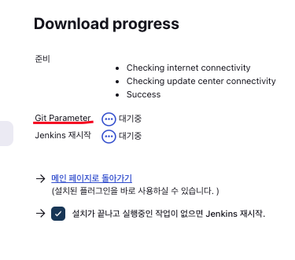

# Node-Mini-Todo

## ...

- 장난감용

## Jenkin use Slack

1. Slack 채널을 생성
2. Slack 앱에 Jenkins ci 구성 추가
3. Jenkins Plugin 중 Slack Notification 추가
4. Config 에서 Slack 추가 (Secret Text로 구성)

<<<<<<< HEAD
=======

## Jenkins use Branching

1. Jenkins에서 진행하는 Branching

- <a href="https://plugins.jenkins.io/git-parameter/">Jenkins Git Parameter Document </a>

2. Github에서 Branching 설정하는 법
>>>>>>> master

## Jenkins pipeline use SCM

1. Pipeline > SCM으로 설정 > URL + Github Hooks 설정

   

2. SCM (Git) > Credentials 설정

   - Credentials Password > Github Basic Token
   - Branch 설정 (Default Master)

     

3. Script Path 설정 (Github에 있는 폴더기준)

   

4. Github > Setting > Webhooks > ~/github-webhook/ 설정

   
