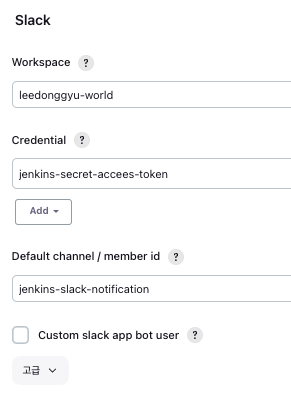
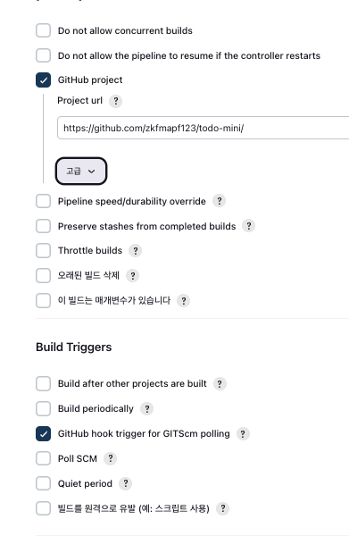
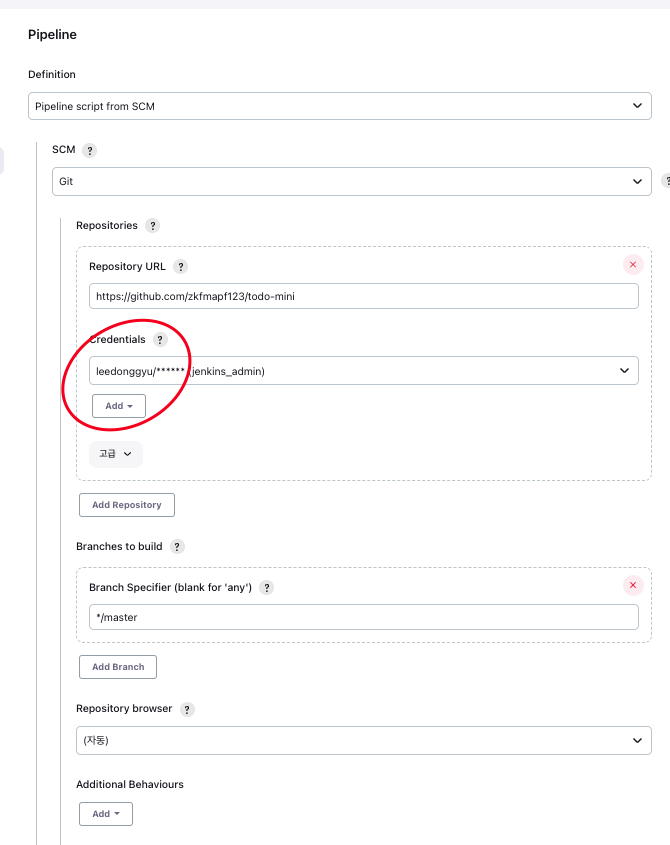
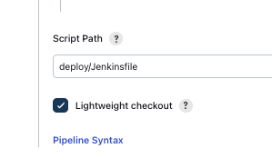
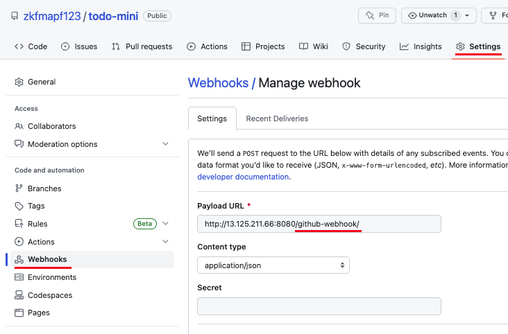

# Node-Mini-Todo

## ...

- 장난감용

## Jenkin use Slack

1. Slack 채널을 생성
2. Slack 앱에 Jenkins ci 구성 추가
3. Jenkins Plugin 중 Slack Notification 추가
4. Config 에서 Slack 추가 (Secret Text로 구성)

## Jenkins use Branching

1. GitHub에서 브랜칭 할 Branch들을 설정한다. (이때 필요한 값들 -> Remote로 올라가게끔 설정)

2. Jenkins pipeline을 설정한 후 한번 빌드를 한다.

3. master는 올라가지 않고, deploy/dev, deploy/qa만 올라간다.

4. Github에서 Branching 설정하는 법

## Jenkins pipeline use SCM

1. Pipeline > SCM으로 설정 > URL + Github Hooks 설정

   

2. SCM (Git) > Credentials 설정

   - Credentials Password > Github Basic Token
   - Branch 설정 (Default Master)

     

3. Script Path 설정 (Github에 있는 폴더기준)

   

4. Github > Setting > Webhooks > ~/github-webhook/ 설정

   
